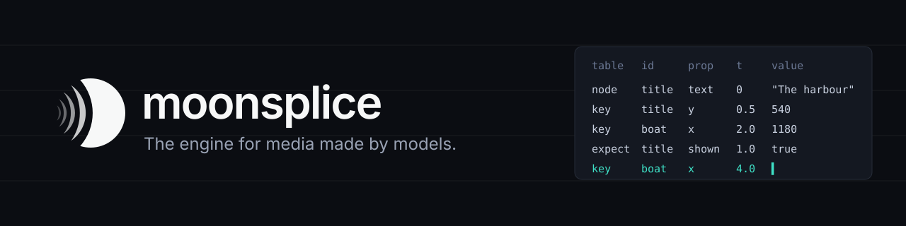
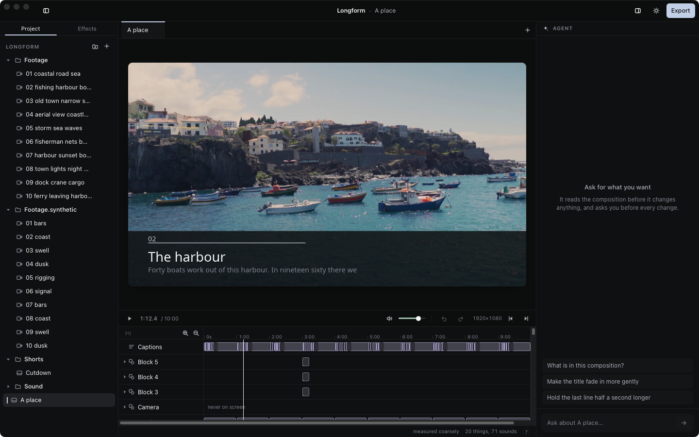
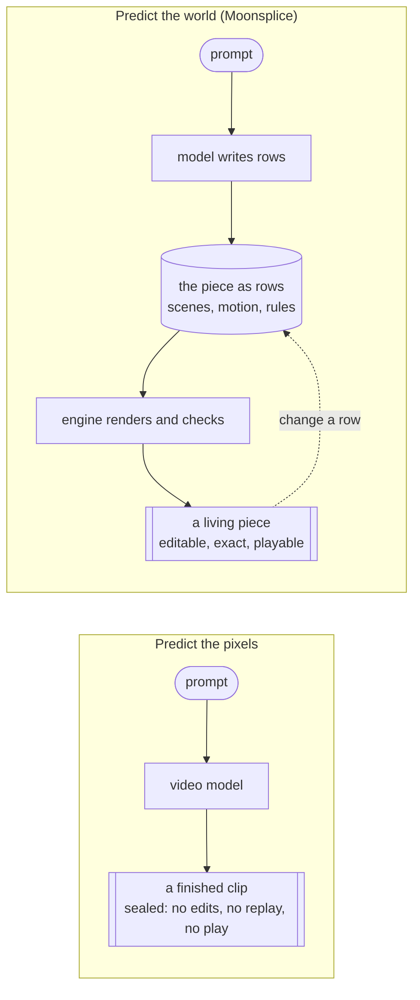
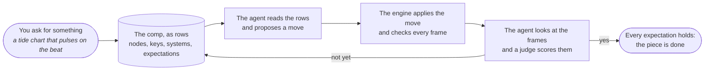
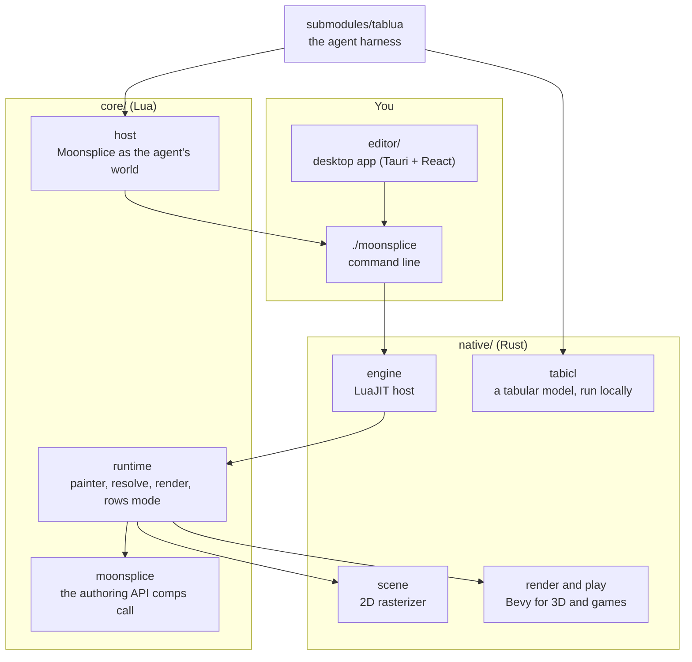

<p align="center">
  
</p>

<p align="center">
  <a href="LICENSE"></a>
  
  
  
  <a href="https://github.com/OpenRelationship/tablua"></a>
  
</p>

# Moonsplice

**Don't generate pixels. Generate the world that makes them.**

There are two ways for AI to make things that move.

The first is to predict the pixels. That is what video models do, and the results can be stunning, but they arrive
finished and sealed: you cannot change one line of a title, replay a scene exactly, play it as a game, or ask why
anything happened.

The second is to predict what makes the pixels: the scenes, the motion, the timing and the rules, which an engine
then renders. The result stays alive. It can be edited, replayed to the exact frame, played, checked and improved.

Moonsplice is an engine built for the second way. Game engines were designed for people clicking in editors.
Moonsplice is designed for models: everything in a piece is a **row**, a plain labelled fact such as *"the title
appears at half a second"* or *"the boat reaches the right edge at two seconds"*. A model reads the whole piece as a
table and makes it by predicting the next row. A person can read the same rows, and the engine checks every one.

<p align="center">
  
</p>



## What you can make

- **Motion graphics and explainers:** titles, charts, captions, type that moves to the beat.
- **Edited video:** clips, tracks, transitions and nested comps, cut from your footage.
- **Games:** a game is a comp that also reads input, so it plays in a window and replays exactly.
- **3D worlds:** meshes, lights and cameras, rendered with Bevy.

A video, a game and a 3D world are the same kind of object here. They differ only in their rows, so one engine, one
checker and one agent serve them all.

## How it works, in one picture



1. **You say what you want.** The agent first writes it down as *expectations*, rows such as "the title is on
   screen at one second". They are what "done" means.
2. **The agent makes one move at a time.** A move is a small, typed change ("add this node", "move this key"),
   never a rewrite of the whole file.
3. **The engine checks every move.** It applies the move, evaluates every frame and reports problems as rows too:
   text off the screen, motion that is too busy, an expectation that fails.
4. **The agent looks at what it made.** It reads a contact sheet of frames, a judge scores them, and the loop
   continues until every expectation holds.

Because each step is recorded as rows (the state, the move, what happened), the system can learn which moves tend
to work. That learner is [Tablua](https://github.com/OpenRelationship/tablua), the agent harness this repository
includes.

## Three promises

Every change to Moonsplice has to keep all three. They are what make the bet work.

| Promise | In plain words | What it means for the code |
| --- | --- | --- |
| **Deterministic** | The same piece always renders the same pixels. | A comp is a pure function of time (and, for a game, its input). No hidden clocks, no unseeded randomness. |
| **Legible** | You can read the whole piece without running it. | `./moonsplice rows COMP --brief` prints every node, key, system and finding. |
| **Forecastable** | A model can guess what comes next. | Every edit and its outcome is a row, so a learner can rank the next move. |

## What a comp looks like

You can write a comp by hand in Lua:

```lua
local e = require("moonsplice")

return e.comp {
  width = 1280, height = 720, duration = 4, fps = 30, background = "#14161f",

  scene = function(s)
    local dot = s:circle { id = "dot", x = 180, y = 360, r = 60, color = "#f28c33" }
    local title = s:text { id = "title", x = 640, y = 360, text = "moonsplice", size = 120,
      color = "#ffffff", opacity = 0, anchor = "center" }

    s:script(function(t)
      t:tween(dot, 1.2, { x = 1100, color = "#e84a5f" }, "cubicInOut")
      t:tween(title, 0.8, { opacity = 1 }, "sineOut")
    end)
  end,
}
```

And this is how the engine shows it back to you, or to a model, as rows:

```text
comp 1280x720, 4s at 30 fps, background "#14161f"; digest 71b3f43e
nodes (draw order; children indented):
  dot circle color="#f28c33" r=60 x=180 y=360
    keys color: "#f28c33"@0.00s -> "#e84a5f"@1.20s cubicInOut
    keys x: 180@0.00s -> 1100@1.20s cubicInOut
  title text anchor="center" color="#ffffff" opacity=0 size=120 text="moonsplice" x=640 y=360
    keys opacity: 0@1.20s -> 1@2.00s sineOut
systems (run every frame after the keys, in order):
findings (lint and check): 0 errors, 1 warnings
  warn cold_open: first motion at t=0 reads as a jump cut; offset 0.1-0.3s
```

The warning is a finding the checker produced, and it is a row like any other: a person or an agent can act on it.

## What is inside



| Folder | What lives there |
| --- | --- |
| `core/` | Almost everything, in Lua: the authoring API, the engine's Lua, the agent's world and the command line. |
| `native/` | The Rust that has to be fast: the LuaJIT host, the rasterizer, Bevy, decoding, tracking and TabICL. |
| `editor/` | The desktop app. Every gesture in it becomes the same typed move the agent uses. |
| `comps/` | The eval suite (`comps/cases`) and its shared media. New work starts fresh in the current DSL. |
| `submodules/` | [Tablua](https://github.com/OpenRelationship/tablua), the agent harness, and [connectory](https://github.com/OpenRelationship/connectory), a directory of APIs with each one a Lua file. Both are developed in their own repositories. |
| `.robot/` | Documentation, rules and tests, all written as Robot Framework suites. |

## Getting started

You need [LuaJIT](https://luajit.org), a [Rust toolchain](https://rustup.rs) and [ffmpeg](https://ffmpeg.org).

```sh
git clone --recursive https://github.com/OpenRelationship/moonsplice
cd moonsplice

./moonsplice rows comps/cases/bounce.lua -o bounce.lua   # an eval case, in rows form
./moonsplice rows bounce.lua --brief                      # read it as rows
./moonsplice lint bounce.lua --json                       # what the checker finds
./moonsplice render bounce.lua -o bounce.mp4              # render it
```

The first command builds the engine once (`cargo build --release` in `native/`), which takes a few minutes.

| Command | What it does |
| --- | --- |
| `rows COMP --brief` | The comp as a model reads it. |
| `patch COMP MOVES.json` | Apply typed moves; a rejected move comes back with the reason. |
| `expect COMP ROWS.json` | Write down what "done" means. |
| `lint`, `check`, `gate` | Findings, and a one-line state: errors, warnings, expectations held. |
| `render`, `hash`, `sheet` | An mp4, a hash per frame, or a contact sheet of chosen frames. |
| `play COMP` | Play a game in a window. |
| `studio --comp COMP --ask TEXT` | Run the agent on a comp. |
| `connect SERVICE` | Connect one of 853 services the agent can use; the key goes to your keychain, never to the agent. |

## Documentation

Documentation lives in `.robot/docs/` as Robot Framework suites, so a page can grow into a test. Run one with
`luajit .robot/run.lua docs/<page>`. Start with these:

- [`design.robot`](.robot/docs/design.robot): the bet, argued in full, with the principles every change keeps.
- [`rows.robot`](.robot/docs/rows.robot): the data model, every table and every move.
- [`reference.robot`](.robot/docs/reference.robot): the authoring reference the agent reads.
- [`AGENTS.md`](AGENTS.md): how to work in this repository, for people and coding agents alike.

## House rules

Moonsplice holds itself to a few rules, each checked by `luajit .robot/run.lua`:

- No source file over 400 lines, so any file can be read whole.
- Documentation and tests are Robot suites, not loose prose.
- Lua is most of the code; Rust only where speed demands it.
- A refactor never changes a pixel: every test comp has golden frame hashes.

## Status

Moonsplice is pre-release. It was rebuilt from an earlier engine, Cadence, in October 2026, and the known gaps
against its own promises are listed, with tests, in [`AGENTS.md`](AGENTS.md#known-gaps-against-the-bet).

## License

[MIT](LICENSE).
